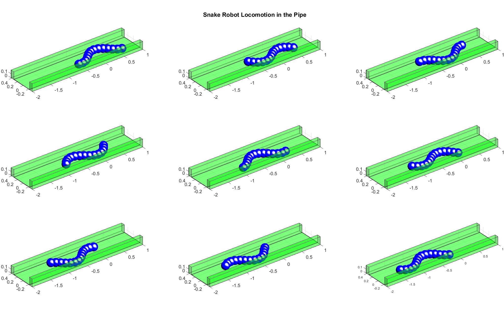
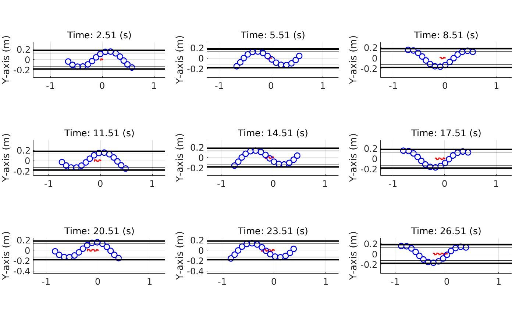

= PipeSnakeRobot =
==================

Open source code written in MATLAB for the paper Mathematical framework for snake robot motion in a confined space.

Run the script by start.m

The results of snake robot motion are in the matrix X. Position of snake robot CoM is in (N+1)-th and (N+2)-th column of the matrix X.

  
  

= Citing the framework =
========================
If you use the framework and want to cite it in a paper please use:

@article{VIRGALA2024,
title = {Mathematical framework for snake robot motion in a confined space},
journal = {Applied Mathematical Modelling},
year = {2024},
issn = {0307-904X},
doi = {https://doi.org/10.1016/j.apm.2024.04.020},
url = {https://www.sciencedirect.com/science/article/pii/S0307904X24001719},
author = {Ivan Virgala and Martin Varga and Peter Ján Sinčák and Tomáš Merva and Roman Mykhailyshyn and Michal Kelemen},
keywords = {Control, Friction, Kinematic model, Dynamic model, Optimization, Snake robot}
}

or use:

Virgala, I., Varga, M., Sinčák, P. J., Merva, T., Mykhailyshyn, R., & Kelemen, M. (2024). Mathematical framework for snake robot motion in a confined space. Applied Mathematical Modelling. doi:10.1016/j.apm.2024.04.020
